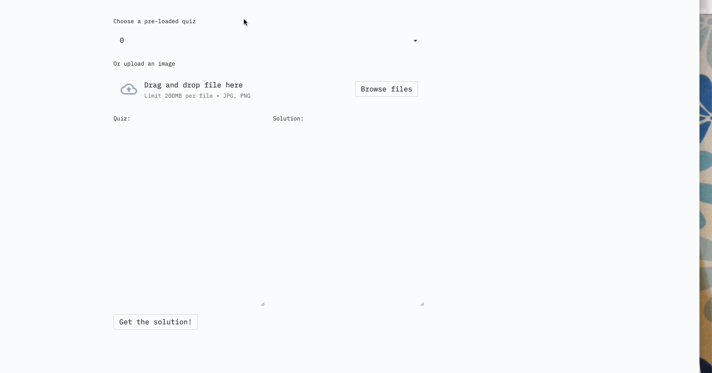
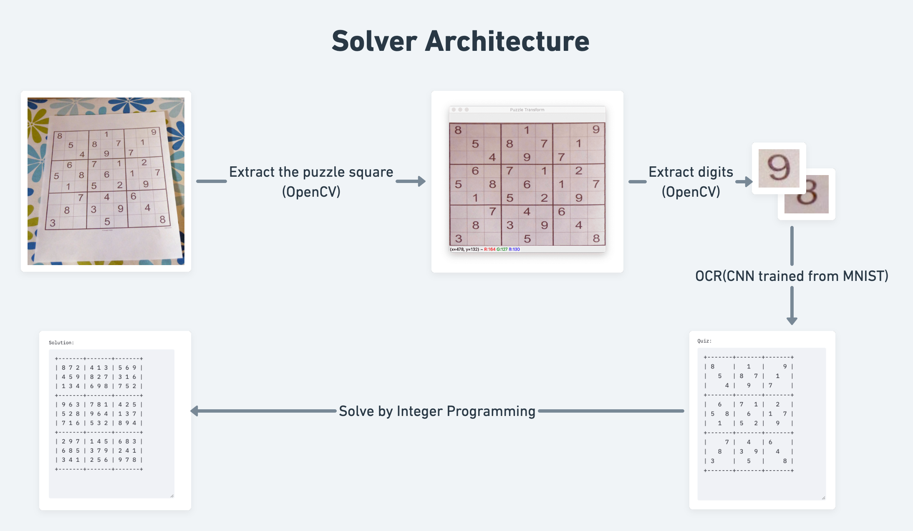

# Sudoku Solver

Below is a project I have done recently to brush upon my technical skills. 
As you can see, you can **upload a sudoku puzzle image, OCR all the digits and get the solution instantaneously**!

(I was wishing to deploy it on Heroku but the project was a bit on the bigger side and exceeded the free dyno's limit)

## Skills Covered
- Computer Vision(OpenCV, OCR)
- Deep Learning(Pytorch, CNN)
- Optimization(Pulp, Linear Programming)

## Architecture

The pipeline consists of three parts:
- **Digit Extraction**. This part is done by OpenCV, which takes a raw image, finds the square that contains the puzzle,
and then goes over each cell and extracts each digit.
- **Digit OCR**. This part is done by Pytorch. For that, I trained a CNN model myself on the MNIST digit recognition dataset.
The predictions are a hit and miss depending on the image input. However, for a production project, the Google Tesseract OCR
would be a much better alternative!
- **Sudoku solver**. This part is done by Pulp. By specifying all the constraints of Sudoku(like each number can appear once in a 3*3 box),
we can let Pulp do all the heavy-lifting and return us the puzzle solution!

## How to use it?
Download the whole repo and run the _run.sh_ file.